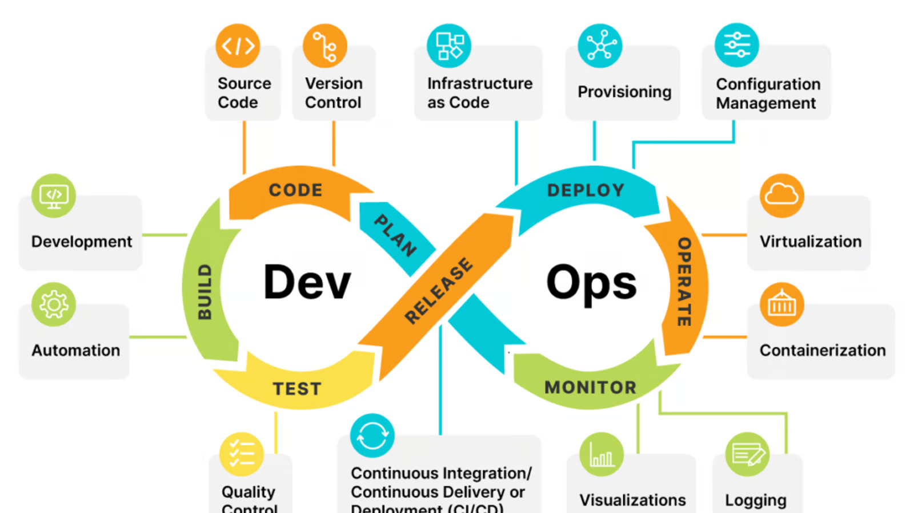
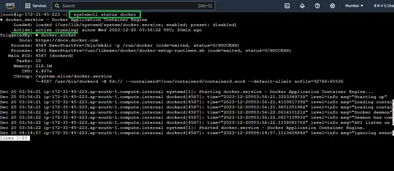

# FIRST DEVOPS PROJECT

  ## Development

  ### Intiallization Python App 

  > Step 1: Clone the Repository: (<https://github.com/E-963/ToDoList-DEPI-Project/tree/main>)
  > Step2: Bash Command for Creat a Virtual Environment

    1. python -m venv venv
    2. pip install virtualenv
    3. source venv/bin/activate
    4. sudo install pip
    5. pip install flask
    6. pip install gunicorn
    7. pip install pytest

  ## HTML. INDEX

  Create Templates file

  ## Install requirements

  pip install -r requirements.txt

  ## Run App

  python3  main.py

  ## Production

  gunicorn wsgi

  # **Testing**

  pytest

  # **Version Control**

  ## GITHUB Commands

  ### - Run

    git config --global user.email "<you@example.com>"
    git config --global user.name "Your Name"
    to set your account's default identity.

### - for add updates to the repository

    git Add .

    git commit -m "comment"
    
    git push
    
    git pull
    
    git status   #for check the last status on repo.

# Building and Packaging 

## CONTAINERIZATION TECHNOLOGY

### Dockerization

  Docker launches the containers in seconds, and the heart of running containerized applications lies in the powerful command known as ‘docker run‘. Docker is the Container Platform tool. It helps in packaging an application with all its dependencies into a single entity, and it supports running the applications as containerized images on any platform that supports Docker. It acts as a gateway for deploying and managing the Docker containers.

### Docker Installation

  #### Install docker, buildx, and docker-compose (alert: may not install latest versions)

  **sudo apt install docker.io docker-compose docker-buildx
  **

  #### Post installation steps: to run docker without sudo (you may need to restart/relogin for changes to take effect)

  **sudo groupadd docker
  sudo usermod -aG docker $USER
  newgrp docker**

#### Checking Docker Service Status

  Before trying the Docker commands, ensure that the Docker software is set and the service is active. Check the status of the docker service as shown in the below the figure:

  ### Checking status of Docker

  

# Test installation

    **docker run hello-world**

    #### If the status of the Docker service isn’t in active mode use it

      **systemctl enable docker --now**

## Docker Container Run

    ```
    docker build -t todolist-depi-project .
    docker run -it -p5000:5000 samaenany/todolist-depi-project
    docker logs 
    docker ps  ## to check container is running 
    ```
    docker run -itd name test p3000:3000 docker run -it -p5000:5000 samaenany/todolist-depi-project  ## to name container and run in background

    // to see logs use it 
    docker logs -f

    // open shell in workdir use command:

    ** docker exec -it test sh **

    ## can check whoami from shell and change from root to USER by add this command in docker file :
    
    ** RUN addgroup -S app && adduse
    
    ** docker images | grep <repo name>  ## to check contsainer images

### stop and remove containers

    docker stop 
    
    docker rm <container ID> -f  ## STOP AND REMOVE RUNNING CONTAINER

    docker container prune    ## to remove all stop containers 

## DOCKER NETWORKING

  ### this link is very useful

    <https://dev.to/manojpatra1991/docker-cheat-sheet-docker-networks-49k4>

# DEPLOYMENT AND RELEASE

## GitHub Actions
    GitHub Actions automates your software development workflows directly in your code repository.
    ### A *.github/workflows/pytest.yml* file triggers tests and Docker image building on push to main branch

## Ansible
