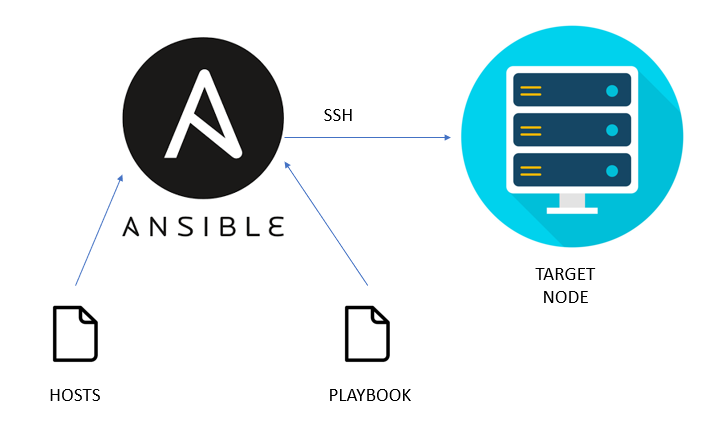
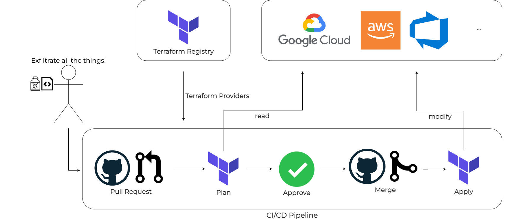
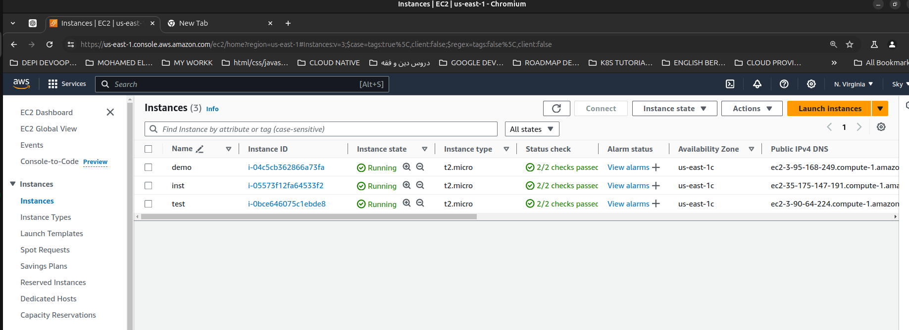

 

# FIRST DEVOPS PROJECT

## Development

### Intiallization Python App

  > Step 1: Clone the Repository: (<https://github.com/E-963/1st-DevOps-Project>)
  
  > Step2: Bash Command for Creat a Virtual Environment

      1. python -m venv venv
      2. pip install virtualenv
      3. source venv/bin/activate   
      4. sudo apt install pip
      5. pip install flask
      6. pip install gunicorn
      7. pip install pytest

### Templates

     index.html

### Static
  
    CSS/style.css
    JS/list.js   

### Install requirements

     pip install -r requirements.txt
     python -m pip freeze 

### Run App

    python3  main.py

## Production

    gunicorn wsgi  // Listening at: http://127.0.0.1:3000

# **Testing**

    pytest

# **Version Control**

## GITHUB Commands

### - Run

    git config --global user.email "<you@example.com>"
    git config --global user.name "Your Name"
    to set your account's default identity.

### - for add updates to the repository

    git Add .

    git commit -m "comment"
    
    git push
    
    git pull
    
    git status   #for check the last status on repo.

# Building and Packaging

## CONTAINERIZATION TECHNOLOGY

### Dockerization

  Docker launches the containers in seconds, and the heart of running containerized applications lies in the powerful command known as ‘docker run‘. Docker is the Container Platform tool. It helps in packaging an application with all its dependencies into a single entity, and it supports running the applications as containerized images on any platform that supports Docker. It acts as a gateway for deploying and managing the Docker containers.

### Docker Installation

      Install docker, buildx, and docker-compose (alert: may not install latest versions)
    
      sudo apt install docker.io docker-compose docker-buildx
  
##### Post installation steps: to run docker without sudo (you may need to restart/relogin for changes to take effect)

        sudo groupadd docker
        sudo usermod -aG docker $USER
        newgrp docker

###### Checking Docker Service Status

#### Before trying the Docker commands, ensure that the Docker software is set and the service is active. Check the status of the docker service as shown in the below the figure

# Test installation

    docker run hello-world

#### If the status of the Docker service isn’t in active mode use it

>systemctl enable docker --now

## Docker Container Run

    - docker build -t test .

    -  docker run -it -p3000:3000 samaenany/todolist-depi-project

    - docker logs
      
    - docker ps       ## to check container is running 
  
### to name container and run in background

docker run -d --name my_todo_app -p 3000:3000 samaenany/todolist-depi-project

### to see logs use it

      docker logs -f

### open shell in workdir use command

     docker exec -it test sh

### can check whoami from shell and change from root to USER by add this command in docker file

    RUN addgroup -S app && adduser
    
    docker images | grep <repo name>  ## to check contsainer images

## DOCKER HUB  

    docker build -t test .

    echo $PASSWORD | docker login -u samaenany/todolist-depi-project
    
    docker push <username/repo name> --all-tags

### stop and remove containers

     docker stop    
     docker rm <container ID> -f          ## STOP AND REMOVE RUNNING CONTAINER
     docker container prune    ## to remove all stop container

## DOCKER NETWORKING

### this link is very useful

(<https://dev.to/manojpatra1991/docker-cheat-sheet-docker-networks-49k4>)

# DEPLOYMENT AND RELEASE (CI / CD )

## GitHub Actions

  GitHub Actions automates your software development workflows directly in your code repository.

### A *.github/workflows/pytest.yml* file triggers tests and Docker image building on push to main branch

    - git status
    - git add -A
    - git commit -m "Add GitHub Action to run tests and Docker file"
    - docker push

## Ansible

    Ansible is a radically simple IT automation system. It handles configuration-management, application deployment, cloud provisioning, ad-hoc task-execution, and multinode orchestration - including trivializing things like zero-downtime rolling updates with load balancers.
    it is agentless server so you don't need  install ansible only on your machine.
    - write a playbook (written in YAML) defines one or more plays that will be exececuted on one or more remote machines (selected from inventory) through an SSH connection (no agent required)
    - A task executes a (https://docs.ansible.com/ansible/2.9/modules/list_of_all_modules.html) (built-in)or against remote machines (default execution strategy is sequential).
    - Ansible Collects return codes from executed tasks.

### To check Ansible run

    - ansible -m ping
    - ansible -m ping localhost

#### Using Ansible playbook pulls the samaenany/todolist-depi-project:latest Docker image from DockerHub and starts a container named my_app_container based on it, mapping port 8000 on localhost to port 8000 in the container by YAML script

### to run

    ansible-playbook site.yml -c ./.ansible.cfg -i ./hosts.ini 

    ansible-playbook site.yml

#### ansible: This command is used to execute ad-hoc tasks on remote hosts

      ansible all -m ping

#### Using -vvv provides enhanced troubleshooting insights into Ansible's interaction with hosts, clarifying playbook execution and facilitating issue diagnosis and operational understanding

     ansible-playbook site.yml -vvv`

# Iac (Infrastructure as a code)

# Terraform

 

### Terraform is an infrastructure-as-code tool developed by HashiCorp, designed to automate the provisioning and management of cloud infrastructure resources. It allows users to define infrastructure in a declarative configuration language and then execute that configuration to create, modify, and manage infrastructure resources across various providers

### Key Concepts in Terraform

    Declarative Configuration: Infrastructure is defined in Terraform using HCL (HashiCorp Configuration Language) or JSON, where you specify the desired state of your infrastructure rather than writing procedural 
   code.

    Providers: Terraform supports multiple cloud and infrastructure providers such as AWS, Azure, Google Cloud Platform, and more. Each provider has its own set of resources that can be managed using Terraform.

    Resources: These are the core building blocks in Terraform configurations. Resources represent infrastructure components like virtual machines, networks, databases, etc., that Terraform will manage.

    State Management: Terraform keeps track of the state of your infrastructure in a state file (terraform.tfstate), which stores mappings between your resources in configuration and real resources provisioned.

## creating AWS instances using Terraform and allow HTTP and SSH traffic, so need to create a Terraform configuration file (typically with a .tf extension) that specifies the AWS provider, defines the instances, and sets up security groups for allowing the necessary traffic. Below is an example configuration for creating Ubuntu 24.04 as example

### Specify the AWS provider credentials

       provider "aws" {
        region = "us-east-1"  # Change to your desired AWS region
        }

      # Define variables
      variable "instance_type" {
        default = "t2.micro"
        }

      variable "ami" {
        default = "ami-0c55b159cbfafe1f0"  # Ubuntu 20.04 LTS AMI ID in us-east-1
        }  

      # Create AWS instance
     resource "aws_instance" "example_instance" {
        ami           = var.ami
        instance_type = var.instance_type
        key_name      = "your_key_pair_name"  # Replace with your key pair name for SSH access

        tags = {
          Name = "ExampleInstance"
         }
       }  
  

  ]

### Provision EC2 instance with the necessary configs to the run one instance of the web application

    nano ~/.aws/config        # Update with your AWS connection config

## Main Terraform Commands

### Initializes a Terraform working directory

       terraform init
  
### Applying and destroying

      terraform validate
  
       terraform fmt
            
       terraform plan
    
       terraform apply
    
       terraform refresh
            
       terraform state
    
       terraform destroy 

# Ansible

### Playbook to install Docker and run the app container on the provisioned instance

    cd ansible
    ansible-galaxy collection install community.docker
    ansible-playbook main.yml    # updated hosts.ini with the outputs from terraform    

# Operation and Monitoring

# Kubernates

### Install Minikube: Ensure Minikube is installed on your local machine. You can install it using a package manager like brew on macOS or download it directly from the Minikube GitHub repository

Install [Kubectl](https://kubernetes.io/docs/tasks/tools/) and [minikube](https://minikube.sigs.k8s.io/docs/start/?arch=%2Flinux%2Fx86-64%2Fstable%2Fbinary+download)

### Start Minikube: Start a Minikube cluster by running

    minikube start

 ## Pod and Namespace
* ## Creates a Pod for the Python application in a namespace 

    kubectl apply -f namespace.yaml -f pod.yaml
    kubectl get pods -n my-app-namespace
    kubectl describe pod my-app -n my-app-namespace

### Configure kubectl: Minikube comes with kubectl preconfigured to interact with the Minikube cluster. Verify that kubectl is configured correctly

    kubectl get nodes

    kubectl get all -n my-app-namespace

### Create Kubernetes Manifests

### Apply each of the manifests to your Minikube cluster

    kubectl apply -f namespace.yaml
    kubectl apply -f deployment.yaml
    kubectl apply -f service.yaml
    kubectl apply -f ingress.yaml
    kubectl apply -f role.yaml

### when deploying on cloud, an external IP for the service will be available. For testing with minikube, run the following command to get a URL for accessing the service
    minikube -n my-app-namespace service app-service --url

* # Create a Helm Chart

    Create a Helm Chart Structure:

    Use the helm create command to scaffold a new Helm chart:

         helm create my-helm-chart

* ### This will create a directory structure including a Chart.yaml, values.yaml, and templates/ directory

## Package the Helm chart by running

    helm package my-helm-chart

## Deploy the Helm chart

    helm upgrade --install app-deployment app-deployment/ --values my_values.yaml
​  
    helm list            # To see installed charts  
    minikube dashboard   # Opens a web UI for debugging
    minikube service app --url # Get service address

# Monitoring

## Deploy Monitoring and Visualization Stack (Prometheus and Grafana)

* ### Create Prometheus and Grafana Manifests

Use Helm charts to deploy Prometheus and Grafana, or create Kubernetes manifests for them.
You can add Prometheus and Grafana as dependencies in a Chart.yaml file or use Helm commands to deploy them directly:

    helm repo add prometheus-community https://prometheus-community.github.io/helm-charts
    
    helm repo update

    helm install prometheus prometheus-community/prometheus --namespace my-namespace
  
    helm install grafana grafana/grafana --namespace my-namespace

* ### Configure Prometheus to Scrape Application MetricsAccessing dashboard

 ### For testing with minkube, metrics plugin should be added 
        minikube addons enable metrics-server

 ### Use 'kubectl port-forward" to access Grafana’s UI:
       kubectl port-forward svc/monitoring-grafana 3000:80 -n monitoring

 ### Login to Grafana (default credentials: admin/admin), add Prometheus as a data source, and create dashboards to visualize the metrics.
 